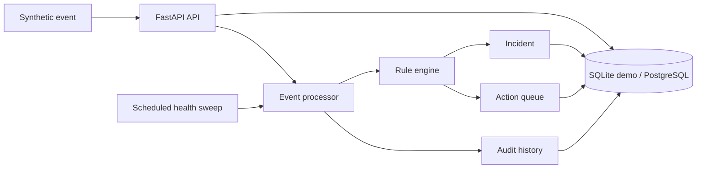

# support-operations-intelligence-platform

[](https://github.com/guilherme-lacerda-tech/support-operations-intelligence-platform/actions/workflows/ci.yml)


A synthetic operations intelligence platform for portfolio use. It receives operational events from
fictional systems, evaluates rules, opens incidents, queues actions, applies cooldowns and keeps an
auditable history.

This is an independent public implementation. It does not contain employer code, private endpoints,
real customer data, production logs, device identifiers or proprietary rules.

## Why

Technical support and operations teams often need more than a ticket list. They need a small system
that turns noisy events into repeatable decisions: when to open an incident, when to wait, when to
retry, when to escalate and how to prove what happened later.

## Architecture



## Features

- FastAPI endpoints for events, rules, incidents, actions and jobs.
- SQLAlchemy models with SQLite demo mode and PostgreSQL-ready configuration.
- Rule engine with severity threshold, category matching and cooldown.
- Incident state transitions and action queue.
- Retryable synthetic action executor with timeout handling.
- Health sweep job that creates follow-up actions for stale open incidents.
- Reproducible demo using only fictional data.

## Quick Start

```bash
python -m pip install -e ".[dev]"
python examples/run_demo.py
uvicorn support_operations_intelligence_platform.api.app:create_app --factory --reload
```

Open `http://127.0.0.1:8000/docs`.

## Tests

```bash
python -m ruff check .
python -m pytest --cov --cov-report=term-missing -q
```

## Docker

```bash
docker compose up --build
```

Docker is included for reproducibility with PostgreSQL. The application also works with SQLite for
local demos and automated tests.

## Example Event

```json
{
  "source": "north-gateway",
  "asset_id": "PUMP-101",
  "category": "offline",
  "severity": 88,
  "message": "Heartbeat missing for the synthetic pump controller"
}
```

## Project Structure

```text
src/support_operations_intelligence_platform/
  api/          FastAPI app and routes
  core/         settings and database session helpers
  services/    rule engine, event processor, jobs and retryable actions
  models.py    SQLAlchemy entities
  schemas.py   Pydantic schemas
tests/         Unit and API tests
examples/      Reproducible demo
```

## Engineering Decisions

- The public domain is intentionally fictional.
- SQLite is the default so the project runs without services.
- PostgreSQL is available through `docker-compose.yml` for production-like local testing.
- Rules are stored in the database instead of hardcoded in Python.
- Cooldown is enforced before queuing repeated actions.

## Security

See [SECURITY.md](SECURITY.md). Use only synthetic data in demos, issues and pull requests.

## Roadmap

See [ROADMAP.md](ROADMAP.md).

