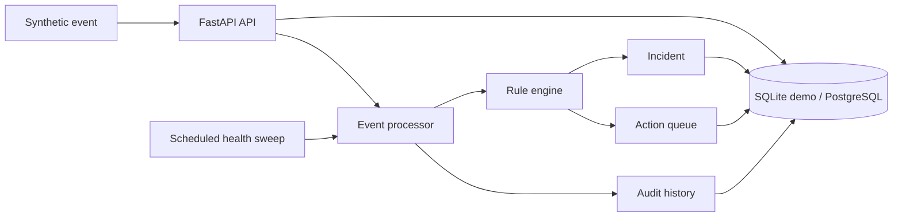

# support-operations-intelligence-platform

[](https://github.com/guilherme-lacerda-tech/support-operations-intelligence-platform/actions/workflows/ci.yml)

[](https://github.com/guilherme-lacerda-tech/support-operations-intelligence-platform/releases)


A synthetic operations intelligence platform for portfolio use. It receives operational events from
fictional systems, evaluates rules, opens incidents, queues actions, applies cooldowns and keeps an
auditable history.

This is an independent public implementation. It does not contain employer code, private endpoints,
real customer data, production logs, device identifiers or proprietary rules.

## Why

Technical support and operations teams often need more than a ticket list. They need a small system
that turns noisy events into repeatable decisions: when to open an incident, when to wait, when to
retry, when to escalate and how to prove what happened later.

## Architecture

See [docs/architecture.md](docs/architecture.md) for the technical overview.



## Features

- FastAPI endpoints for events, rules, incidents, actions and jobs.
- SQLAlchemy models with SQLite demo mode and PostgreSQL-ready configuration.
- Rule engine with severity threshold, category matching and cooldown.
- Idempotency keys for repeated external intent.
- Incident state transitions and durable action queue.
- Persistent worker path with queued/retry states, leases and restart recovery.
- Retryable synthetic action executor with timeout handling.
- `/metrics` endpoint with backlog, retry, cooldown, idempotency and latency counters.
- Structured JSON application logs with synthetic correlation IDs.
- Small persisted check state machine for phase/confirmation/timeout workflows.
- Lightweight migration workflow for existing SQLite demo databases.
- Health sweep job that creates follow-up actions for stale open incidents.
- Reproducible demo using only fictional data.

## Quick Start

```bash
python -m pip install -e ".[dev]"
python examples/run_demo.py
uvicorn support_operations_intelligence_platform.api.app:create_app --factory --reload
```

Open `http://127.0.0.1:8000/docs`.

## Tests

```bash
python -m ruff check .
python -m pytest --cov --cov-report=term-missing -q
dotnet build dotnet/OpsIntelligenceCleanRoom.sln
dotnet test dotnet/OpsIntelligenceCleanRoom.sln
```

## Docker

```bash
cp .env.example .env
docker compose up --build
```

Docker is included for reproducibility with PostgreSQL. The application also works with SQLite for
local demos and automated tests. Compose binds app and database ports to `127.0.0.1` for local-only
access. In the current home-PC validation, Docker CLI was present but the Docker Desktop daemon did
not start, so PostgreSQL/Compose execution is not claimed.

## Example Event

```json
{
  "source": "north-gateway",
  "asset_id": "PUMP-101",
  "category": "offline",
  "severity": 88,
  "message": "Heartbeat missing for the synthetic pump controller"
}
```

More request/response examples are in [docs/api-examples.md](docs/api-examples.md).

## Project Structure

```text
src/support_operations_intelligence_platform/
  api/          FastAPI app and routes
  core/         settings and database session helpers
  services/    rule engine, event processor, jobs and retryable actions
  models.py    SQLAlchemy entities
  schemas.py   Pydantic schemas
tests/         Unit and API tests
examples/      Reproducible demo
```

## Engineering Decisions

- The public domain is intentionally fictional.
- SQLite is the default so the project runs without services.
- PostgreSQL is available through `docker-compose.yml` for production-like local testing.
- Rules are stored in the database instead of hardcoded in Python.
- Cooldown is enforced before queuing repeated actions.
- Idempotency is separate from cooldown: idempotency keys represent the same external operation, while cooldown suppresses similar events inside a time window.
- The Python worker uses the database as the source of truth for queued/retry actions; in-memory queues are not required for recovery.
- The .NET clean-room implementation intentionally documents the V1 race condition and V2 transaction correction instead of hiding the bug.

## Benchmark

See [benchmarks/python-vs-dotnet-results.md](benchmarks/python-vs-dotnet-results.md).

Summary of the current V2 result:

- The first .NET long-running benchmark exposed a cooldown/idempotency race.
- The .NET implementation was corrected with a SQLite `BEGIN IMMEDIATE` transaction around the decision boundary.
- The final V2 long-running run matched Python and .NET counters exactly for events, incidents, actions, suppressions, retries and failures.
- .NET showed lower CPU and stronger HTTP concurrency headroom; Python remained suitable for moderate load.

## Current Limitations

- The Python implementation now has idempotency keys and durable worker recovery; the .NET implementation has the corrected transactional cooldown path, but idempotency-key parity is a future V3 decision.
- This is still production-like portfolio software, not a production-ready service. Auth/RBAC, operational deployment, backup/restore and full PostgreSQL migration validation are intentionally not claimed here.

See [docs/adr/0001-fastapi-sqlalchemy-synthetic-ops.md](docs/adr/0001-fastapi-sqlalchemy-synthetic-ops.md).

## Security

See [SECURITY.md](SECURITY.md). Use only synthetic data in demos, issues and pull requests.

## Contributing

See [CONTRIBUTING.md](CONTRIBUTING.md).

## Roadmap

See [ROADMAP.md](ROADMAP.md).
