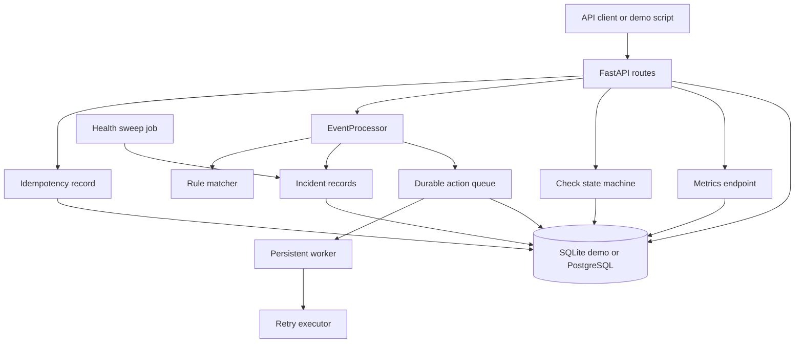

# Architecture

## Design Goal

Turn synthetic operational events into auditable incidents and support actions without depending on any real provider, private queue or production endpoint.

## Components

## Data Flow

1. A synthetic event is received by the API or demo script.
2. If an idempotency key is present, the processor either owns the new operation or replays the persisted result.
3. The processor verifies the asset and persists the raw event with a synthetic correlation ID.
4. Rules are matched by category, severity threshold and cooldown window.
5. Matching rules create incidents and durable queued actions.
6. The worker leases due actions, performs one attempt, and persists succeeded, retry or failed state.
7. Restart recovery reads queued/retry actions from the database instead of relying on memory.
8. Health sweep jobs create follow-up actions for stale open incidents.
9. Check runs model small operational phase flows: pending, started, waiting confirmation, confirmed, timeout, cancelled and failed.

## Boundaries

- SQLite is the default for fast local demos and tests.
- PostgreSQL is available through Docker Compose for production-like local validation.
- Rules are database-backed so behavior can be inspected and changed without editing Python code.
- The project uses fictional assets, messages and teams only.

## Idempotency vs Cooldown

Idempotency key:

- protects one external operation from being processed twice;
- returns the same event/incident/action result on replay;
- is backed by a unique persisted `idempotency_records` row.

Cooldown:

- suppresses similar events inside a time window;
- is based on recent open incidents for an asset/rule;
- does not block a legitimate new incident after the cooldown expires.

## Worker Recovery

Actions are persisted with:

- `state`: queued, retry, succeeded, failed or skipped;
- `attempts`;
- `next_attempt_at`;
- `lease_id` and `leased_at`.

A worker can die after leasing an item. A later worker treats stale leases as recoverable and processes the same action row, avoiding duplicate action rows.

## Observability

The API exposes `/metrics` with operational counters including:

- events received;
- incidents created;
- actions queued/processed/failed;
- retry attempts;
- cooldown suppressions;
- idempotency hits;
- queue backlog;
- oldest queued item age;
- average action latency.

Event processing and idempotency replay emit JSON log lines with synthetic correlation/event IDs.

