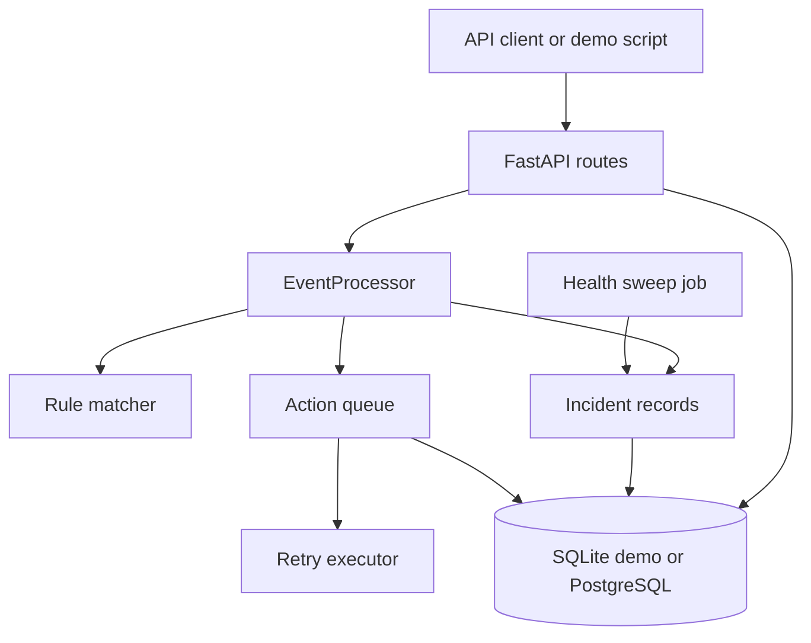

# Architecture

## Design Goal

Turn synthetic operational events into auditable incidents and support actions without depending on any real provider, private queue or production endpoint.

## Components

## Data Flow

1. A synthetic event is received by the API or demo script.
2. The processor verifies the asset and persists the raw event.
3. Rules are matched by category, severity threshold and cooldown window.
4. Matching rules create incidents and queued actions.
5. The retry executor records attempts, success, permanent failure or manual review.
6. Health sweep jobs create follow-up actions for stale open incidents.

## Boundaries

- SQLite is the default for fast local demos and tests.
- PostgreSQL is available through Docker Compose for production-like local validation.
- Rules are database-backed so behavior can be inspected and changed without editing Python code.
- The project uses fictional assets, messages and teams only.

